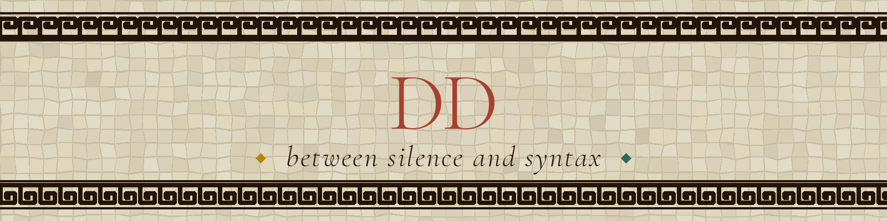

##  about me

 msc data science @ king's — time series & sequential decision-making  
 ucl basc arts & sciences alum — where the history habit and the data habit learned to share a desk  
 off-screen: byzantine & roman material culture, ancient jewellery, ceramics

##  toolkit

 python · pandas · numpy · scikit-learn  
 pytorch · hugging face  
 time series forecasting · reinforcement learning  
 sql · git

##  building

| name | description |
| --- | --- |
| [`derindidinedin.com`](https://derindidinedin.com) | generative roman mosaic — a rule-based compositional grammar doing procedural generation over a constraint system, the way ancient workshops actually worked |
| [`dd-logo-ga`](https://github.com/derindidinedin/dd-logo-ga) | a genetic algorithm searching the space of calligraphic dd monograms — fitness-driven optimisation over glyph parameters |

<!-- add data-science coursework / projects here as they land — e.g. a time-series forecasting repo, an RL agent, a notebook write-up -->

<!-- ▼ GITHUB STATS — preview block. to hide it, delete from this marker down to the ▲ marker (nothing else depends on it). -->
##  github

<!-- ▲ GITHUB STATS end -->

##  writing

essays on ancient history, objects and what they carry, and things noticed in data — sometimes long and carefully argued, sometimes a paragraph that arrived complete. both are legitimate.

→ [derindidinedin.com/essays](https://derindidinedin.com/essays)

##  find me

 website: [`derindidinedin.com`](https://derindidinedin.com)

 

*precision as art · emotion as structure*

